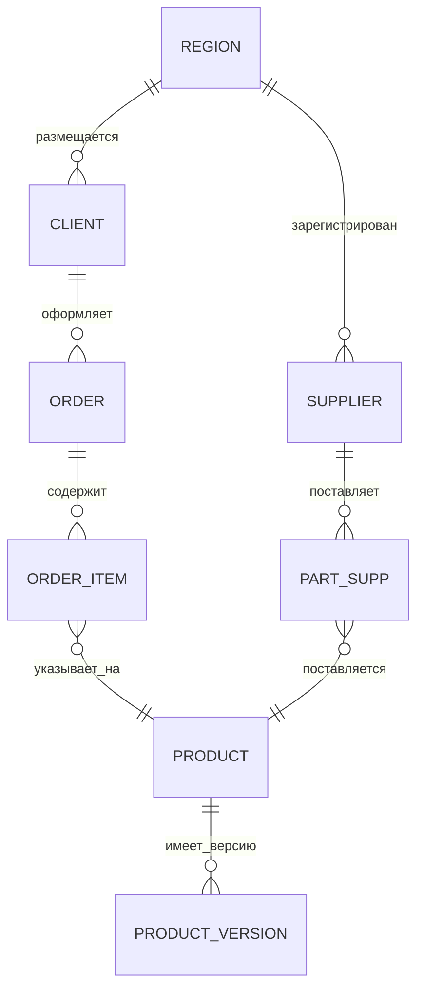

# bd_project
Домашнее задание

```mermaid
erDiagram
    REGION ||--o{ CLIENT : размещается
    REGION ||--o{ SUPPLIER : зарегистрирован

    CLIENT ||--o{ ORDER : оформляет
    ORDER ||--o{ ORDER_ITEM : содержит
    ORDER_ITEM }o--|| PRODUCT : указывает_на

    SUPPLIER ||--o{ PART_SUPP : поставляет
    PART_SUPP }o--|| PRODUCT : поставляется

    PRODUCT ||--o{ PRODUCT_VERSION : имеет_версию
```
