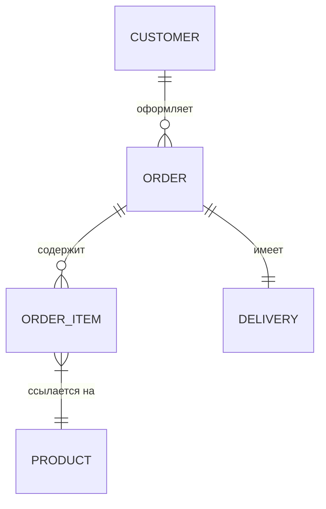

# bd_project
Домашнее задание

```mermaid
erDiagram
    CUSTOMER ||--o{ ORDER : "оформляет"
    ORDER ||--o{ ORDER_ITEM : "содержит"
    ORDER_ITEM }|--|| PRODUCT : "ссылается на"
    ORDER ||--|| DELIVERY : "имеет"
```
